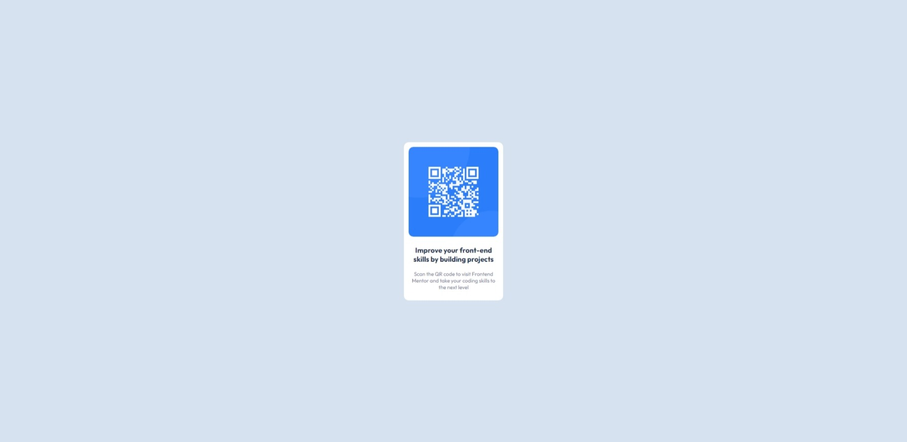

# Frontend Mentor - QR code component solution

This is a solution to the [QR code component challenge on Frontend Mentor](https://www.frontendmentor.io/challenges/qr-code-component-iux_sIO_H).

## Table of contents

- [Overview](#overview)
  - [Screenshot](#screenshot)
  - [Links](#links)
- [My process](#my-process)
  - [Built with](#built-with)
  - [What I learned](#what-i-learned)
  - [Continued development](#continued-development)
  - [Useful resources](#useful-resources)
- [Author](#author)
- [Acknowledgments](#acknowledgments)

## Overview

### Screenshot

- Desktop Ver.


- Mobile(375px) Ver.


## My process

### Built with

- Semantic HTML5 markup
- CSS custom properties
- Flexbox

### What I learned

In this project I learned more about CSS than HTML. Most of the time I spend on flexbox and basic concepts. To learn and understand, I used MDN which clearly and reliably explained to me how flexbox works. Especially helpful was the information about the alignment of elements in a flex container. The distinction between align-items and justify-content, helped me in this project.

```css
body {
    font-size: 15px;
    font-family: 'Outfit', sans-serif;
    width: 1440px;
    margin: auto;
    padding-top: 100px;
    background-color: hsl(212, 45%, 89%);
    display: flex;
    flex-direction: column;
    align-items: center;
    justify-content: center;
}
```

### Continued development

In the future, I definitely want to focus on learning exactly how to create components according to imposed rules. Everything always comes back in my head to the fact that somewhere someone invented some rule of creating websites and I create as it seems to me (the effect can be seen in the project)

### Useful resources

- [Aligning Items in a Flex Container](https://developer.mozilla.org/en-US/docs/Web/CSS/CSS_Flexible_Box_Layout/Aligning_Items_in_a_Flex_Container) - As I mentioned earlier on MDN you can very quickly find out about any element you are interested in when creating a page.
- [CSS @media Rule](https://www.w3schools.com/cssref/css3_pr_mediaquery.asp) - This is an amazing article that helped me finally understand media query. I recommend it to anyone who is still learning this concept.
- [Breakpoint Rules](https://dev.to/sobhandash/media-queries-and-breakpoints-2022-4gkm)


## Author

- Website - [PiotrekZie](https://piotrekzie.github.io/zielonsky-web/)
- LinkedIn - [/in/piotr-zielinskii](https://www.linkedin.com/in/piotr-zielinskii/)
